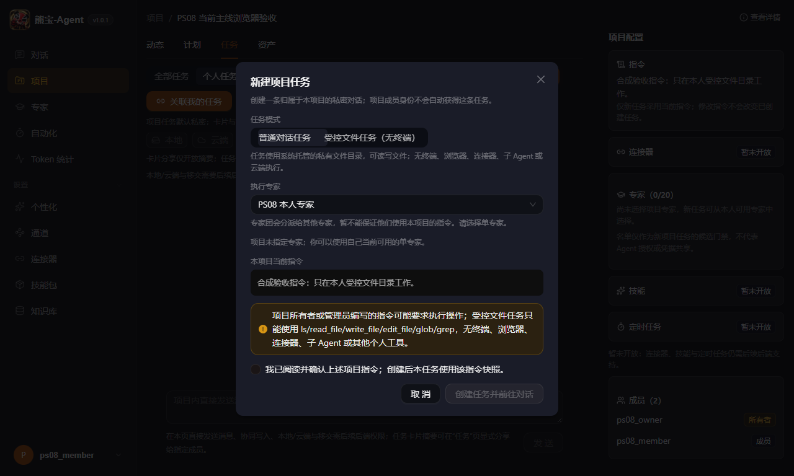
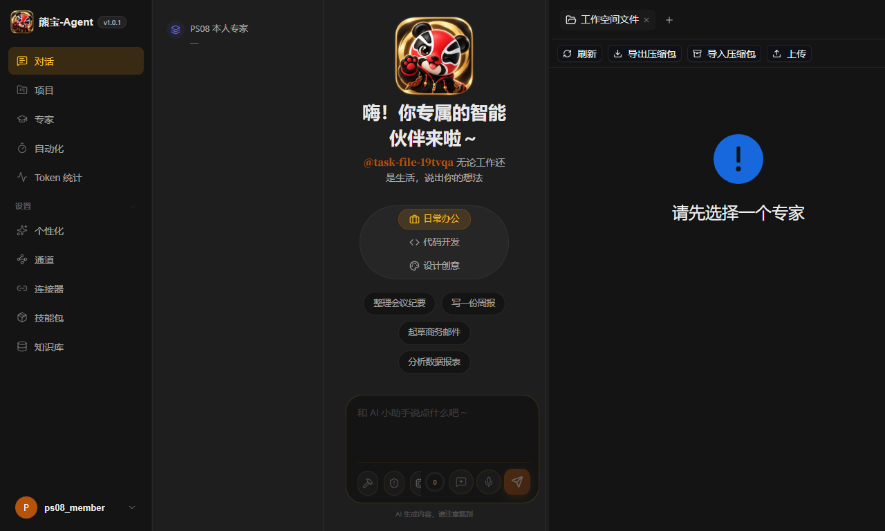

# 030A PS-08：当前主线 TCP 浏览器工作区 RED

日期：2026-09-28。浏览器与后端均绑定源码 `44a2fd47f863700d9d4a50df2e51047887a53353`；相对产品代码基线 `849bb7562faa5ec42db4a0d82495dc2545e1486f`，中间提交只改变四份计划和验收文档。**本轮已用真实 Chrome 复现本人私有任务工作区断链，尚无修复候选；文件模式激活仍为 NO-GO。**

## 证据边界

使用独立系统临时目录中的全新 SQLite，通过 TCP 启动真实 OctopServer、AgentManager 与 Harness；前端为同一源码的 Vite 开发服务器，两个地址均为 `127.0.0.1`，端口分别为 `18781` 和 `5197`。Python 模块实际路径、源码 SHA、进程、数据目录及开关状态记录在[浏览器结果](evidence/ps08-ui-gate-20260928/browser-result.json)的 `server` 字段中。

产品默认 `PROJECT_TASK_FILES_MODE_ENABLED = False`。仅该临时后端进程把开关设为 `True`，模型工厂替换为已有贯通测试的本地 `_RecordingChatModel`。建立三个合成普通用户（项目 owner、任务创建者 member、outsider）及一个合成 admin；没有接入真实账户。最终[模型计数](evidence/ps08-ui-gate-20260928/model-calls.json)为 **0 次模型推理**：本轮没有发送聊天消息、调用模型文件工具或付费 provider。模型实例的启动数量不能当作推理次数。

## 实际结果

| 路径 | 结果 | 证明范围 |
| --- | --- | --- |
| 本人通过项目页创建文件任务 | **201**；界面选择文件模式并确认项目指令，提交请求的专家 ID、`mode=files` 和 64 位指令摘要均经脚本断言；返回独立 runtime 与绑定 thread | 真实浏览器任务创建路径；只在临时开启的夹具内可用 |
| 聊天深链归属验证 | 本人的已有 thread history **200**；关闭默认展开的任务概览后，工作区按钮可点击 | 验证后的聊天页面和入口状态，不证明目录面板成功 |
| 本人的文件接口 | PUT 写入、GET 读取、download 下载及 root tree 均 **200**，读取和下载的 canary 字节一致，目录含 `notes` | 真实 TCP HTTP，走真实 runtime；这些读写断言由 Node fetch 调用，不是文件面板交互 |
| 其他身份的私有访问 | 项目 owner、outsider、admin 的 tree、download、history 共 **9 次 403**，错误代码与 `{internal: true}` 均匹配 | 这三个身份被拒绝读取该成员的私有目录、下载和聊天记录；未扩写为所有接口权限验收 |
| 项目卡片与最小卡片 | owner 项目任务列表不含该私有 thread/runtime；outsider 项目详情 **404**；本人 `/agents` 返回带 `internal=true` 的最小运行卡片，未带检查的 config、prompt、workspace、model、connector 字段 | 原始 API 最小卡片本来允许本人解析深链；它不能等同于普通可管理专家列表 |
| 工作区文件面板 | **RED_REPRODUCED，脚本预期失败退出 1**；面板显示“请先选择一个专家”，10 秒观察窗口内未收到当前 runtime 的根目录树响应；浏览器 page error 为 **0** | 前端就绪判断断链已在真实登录态复现，尚未 GREEN |
| 临时服务退出 | 分别向两条准确的 exec 会话发 Ctrl-C，终端完成；随后确认两个端口均无监听 | [停机记录](evidence/ps08-ui-gate-20260928/cleanup.json)。保留临时夹具数据供调查，没有删除已有用户数据 |

文件接口原始状态见[HTTP trace](evidence/ps08-ui-gate-20260928/private-http-trace.json)，浏览器已收到的响应状态与检查标志见[最终结果](evidence/ps08-ui-gate-20260928/browser-result.json)。任务创建检查点保存于[独立记录](evidence/ps08-ui-gate-20260928/task-create-checkpoint.json)。

原始 JSON 中 `drawer.rootRequested=false` 实际由 `waitForResponse` 超时计算；脚本没有独立采集浏览器 request 事件，因此此字段只能证明未观察到匹配响应，不能单独证明零请求。真实抽屉显示未选择专家，加上既有行为 RED 的零 mock 调用和源码就绪 guard，是断链的另两层证据。后继候选复验须同时采集 request、response 和失败事件；保留原始字段与结果，不改写已发生的日志。

## 浏览器截图

文件模式及待确认指令弹窗；此帧的确认框未勾选、创建按钮禁用。实际确认和提交 201 以脚本断言及创建检查点为准：

通过聊天归属验证后，工作区错误显示未选择专家：

截图使用 **1280 × 768** 视口；对应可访问性快照见[页面状态](evidence/ps08-ui-gate-20260928/browser-aria.txt)。这些是熊宝本地浏览器证据，未做 WorkBuddy 同状态视觉对照。

## 调试过程与可重现路径

原始创建脚本先因 AntD Select 的隐藏输入和隐藏虚拟选项停止，两次均未提交任务；检查真实弹窗后，确认唯一本人专家已默认选中，去掉多余选择动作。第三次实际创建成功，随后因为默认任务概览展开、浮动工作区按钮未显示而超时。纠正脚本为先关闭可见的概览 tab，再进入工作区；没有把该显示条件报成产品缺陷，也没有强制点击隐藏元素。

首份续测脚本还错误要求原始 `/agents` 响应不含本人内部卡片，核对 API 合同后改为检查最小卡片的敏感字段省略。它不是权限泄漏。最后的续测完整执行并在真实抽屉上复现 RED；创建检查点保留原超时信息，不能单独当作旅程通过。

本地脚本与失败调试产物保存在：

`C:/Users/canqu/Documents/Codex/2026-09-23/qctop-work-buddy-agent-logo-ui-3/work/output/playwright/ps08-current-44a2fd47-20260928/`

运行顺序为：`fixture_server.py` 启动全新临时后端 → 同一源码 Vite → `browser_probe.cjs` 创建合成身份及界面任务 → `continuation_probe.cjs` 在该创建检查点上验证 HTTP 与工作区。两个脚本断言源码和服务身份，账号 token 只保存在内存中；本次提交仅保存文档、截图与无 token 的结果，未纳入数据库、凭据或业务代码。最早两份夹具也已停止，当前夹具停机后的模型计数为 0。

## 门禁与后续范围

[四文件修复计划](PROJECT_TASK_WORKSPACE_030_UI_GATE_PLAN_20260928.md)和[路由状态](PROJECT_TASK_WORKSPACE_030_UI_GATE_EXECUTION_STATUS_20260928.md)仍有效：将显式私有任务标记从已核验的聊天入口传到真实抽屉，并仅在该标记下用专用 getter 判断匹配的内部运行体。两条批准的实现路由均已终止且没有产品差异；Codex 对这四文件的单独承接授权尚未收到，未用其他任务的授权替代。

本轮没有执行浏览器刷新/后端重启/成员撤出后的矩阵，没有逐个调用六个模型工具，没有运行生产构建、全仓回归或 `make all`。既有 ASGI 重启与 WebSocket 工具测试是[另一层证据](PROJECT_TASK_WORKSPACE_030_PS08_CURRENT_HEAD_VALIDATION_20260928.md)。独立 GLM 固定 SHA 补审、真实模型、运行时 TOCTOU、WorkBuddy 自选本地目录/云端执行及逐状态视觉仍未核销。通用文件面板中未受支持的操作按钮也尚未收口，不能据本轮接口正例激活文件模式。

证据提交的专项核对通过：三份文档相对链接、源码 SHA 与夹具标志、四项文件 HTTP 正例、九项拒绝、模型零推理、两张 PNG 尺寸及文本无 token 字段。独立只读子代理发现两处 P2 表述过宽，修正后复核均关闭、无新增问题；这不是原定 GLM 补审。暂存仅含三份文档和八份证据，`git diff --cached --check` 通过。正常提交钩子实际尝试 `make precommit`，因 Windows 环境缺少 `make` 立即失败，未进入格式、类型或测试阶段；本次仅文档与证据提交使用 `SKIP_PRECOMMIT=1` 同步，不把该钩子记为通过，也不纳入未通过的行为测试。
